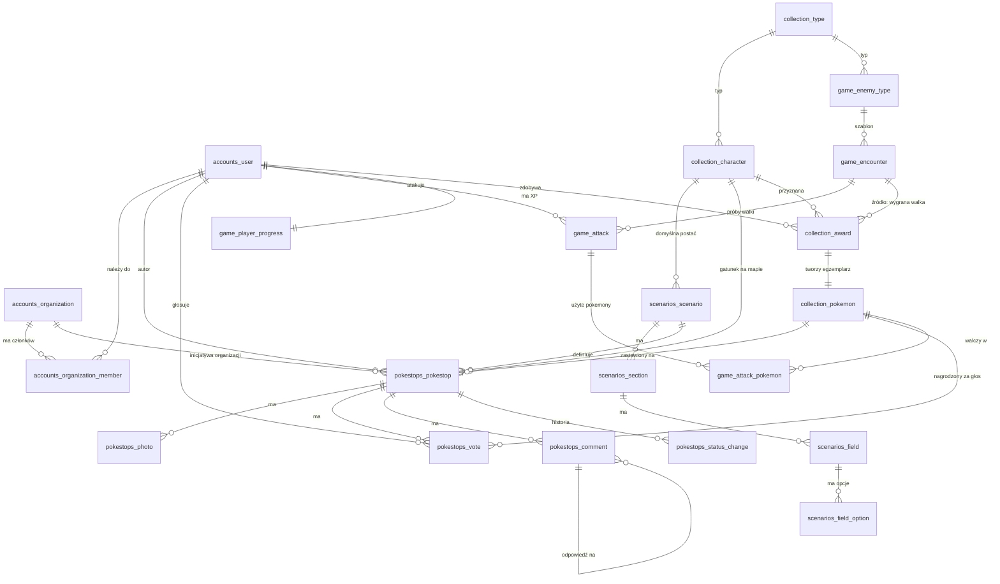

# Baza danych

PostgreSQL 15+ z **PostGIS** (współrzędne) i **citext** (e-maile bez rozróżniania wielkości liter).

## Pliki

| Plik | Zawartość |
|---|---|
| [`schema.sql`](schema.sql) | Struktura: 21 tabel, 2 widoki/funkcje pomocnicze, 12 typów ENUM, indeksy, triggery |
| [`seed_reference.sql`](seed_reference.sql) | Słowniki: 6 typów, 5 postaci i 4 szablony przeciwników |
| [`seed_scenarios.sql`](seed_scenarios.sql) | Katalog 20 scenariuszy (**generowany** z kodu frontendu) |

Kolejność: `schema.sql` → `seed_reference.sql` → `seed_scenarios.sql`.

```bash
createdb smartcity
psql smartcity -v ON_ERROR_STOP=1 -f docs/db/schema.sql -f docs/db/seed_reference.sql -f docs/db/seed_scenarios.sql
```

Odtworzenie seedu scenariuszy po zmianie katalogu we frontendzie: `cd frontend && npm run db:seed-scenarios`.

> **Django:** to docelowy kształt, a nie zamiennik migracji. Modele mają go odwzorować, a `makemigrations` wygeneruje DDL
> (`django.contrib.gis` dla pól geograficznych, `CITextField`, ograniczenia jako `CheckConstraint`/`UniqueConstraint`).
> Tabele są nazwane tak jak w Django (`<aplikacja>_<model>`), więc mapowanie jest 1:1.

## Walka pokemonami

To jest centralna mechanika gry (patrz `opis.md`), zaimplementowana w pełni — nie jako sam check-in lokalizacyjny:

1. **Typy.** Każda postać (`collection_character`) i każdy szablon przeciwnika (`game_enemy_type`) ma `type_id`
   (słownik `collection_type`: transport, czystość, zieleń, energia, powietrze, infrastruktura).
2. **Moc.** Poziom i moc pokemona **nie są kolumnami** — tak jak poziom gracza (`game_player_progress.xp`), baza trzyma
   tylko `collection_pokemon.exp`; aplikacja wylicza z niego poziom i moc na podstawie `collection_character.base_power`
   i `power_growth` (wzór może się zmieniać bez migracji). To samo po stronie przeciwników: `game_encounter.power` jest
   migawką mocy policzonej z `game_enemy_type.base_power`/`power_growth` i poziomu w chwili wygenerowania.
3. **Wybór pokemonów.** Gracz atakuje przeciwnika maksymalnie trzema własnymi, niezastawionymi pokemonami
   (`game_attack_pokemon`, do 3 wierszy na `game_attack`, wymuszone triggerem).
4. **Mnożnik typu.** Jeśli typ pokemona = typ przeciwnika, jego moc w tej walce liczy się razy **1.2**
   (`game_attack_pokemon.type_multiplier_applied`). To stała aplikacyjna (jak promień ataku 50 m), nie wiersz w bazie —
   tabela przechowuje tylko migawkę zastosowanego mnożnika, do audytu.
5. **Rozstrzygnięcie.** Przeciwnik jest pokonany, gdy suma (moc × mnożnik) wybranych pokemonów **przewyższa**
   `game_encounter.power` → `outcome = 'won'`, inaczej `'lost'` (nowa wartość enuma `attack_outcome`; zasięg GPS wciąż
   sprawdzany jako `'too_far'` przed samą walką).
6. **Nagrody za wygraną:** (a) EXP (= `game_encounter.xp_reward`) dla każdego z użytych pokemonów, (b) nowa postać do
   kolekcji (`collection_award`, `source='encounter'`) — to odpowiedź na pytanie z `opis.md` "co wygrywa za wygrane
   walki", (c) XP gracza (`game_player_progress.xp`, jak dotychczas). Punkty (a)–(c) ustala aplikacja w jednej
   transakcji, bo samo rozstrzygnięcie wymaga policzenia mocy po stronie serwera — nie da się tego wymusić samym
   triggerem licznika (w przeciwieństwie do głosów, patrz niżej).

### Pokemony poza walką

- **Stawianie pokemona na zgłoszeniu** (`report`/`idea`): autor wybiera jednego z własnych, niezastawionych pokemonów
  (`pokestops_pokestop.staked_pokemon_id`); trigger oznacza go jako zastawiony (`collection_pokemon.is_staked`) i
  wymaga, by jego gatunek zgadzał się z `character_id` pinezki (to on jest widoczny na mapie). Gdy `votes_for`
  osiągnie `votes_required`, trigger zwraca go autorowi i dopisuje **+50 exp** (stała — patrz "Decyzje projektowe").
- **Głosowanie** (każdy typ pinezki): głosujący wskazuje jednego z własnych pokemonów (`pokestops_vote.rewarded_pokemon_id`),
  który dostaje **+10 exp** za sam akt głosu (trigger, tylko przy pierwszym głosie). To zastępuje wcześniejszy pomysł
  "nowa postać za głos" — wg `opis.md` głos daje EXP istniejącemu pokemonowi, nowego zwierzaka dostaje się z walk i
  (jednorazowo) przy starcie.
- **Pokemon startowy:** przy `/auth/guest` i `/auth/register` aplikacja przyznaje jeden egzemplarz gatunku z
  `collection_character.is_starter = true` (`collection_award.source = 'starter'`, jeden na użytkownika — unikalny
  indeks). Bez tego nowy gracz nie miałby czym głosować.

## Diagram



## Podział na aplikacje (SRP)

| Aplikacja | Odpowiada za | Tabele |
|---|---|---|
| `accounts` | tożsamość, role, organizacje | `accounts_user`, `accounts_organization`, `accounts_organization_member` |
| `scenarios` | katalog formularzy (dane, nie kod) | `scenarios_scenario`, `_section`, `_field`, `_field_option` |
| `pokestops` | pinezki, głosy, komentarze, zdjęcia, moderacja | `pokestops_pokestop`, `_photo`, `_vote`, `_comment`, `_status_change` |
| `collection` | typy, postacie, posiadane pokemony i ich zdobywanie | `collection_type`, `collection_character`, `collection_award`, `collection_pokemon`, widok `collection_user_character` |
| `game` | przeciwnicy, walki (moc/typ/mnożnik), XP gracza | `game_enemy_type`, `game_encounter`, `game_attack`, `game_attack_pokemon`, `game_player_progress` |

Zależności: `pokestops` → `scenarios`, `accounts`, `collection`; `scenarios` → `collection` (domyślna postać);
`game` → `accounts`, `collection` (typy przeciwników i pokemony użyte w walce).

**`collection` ↔ `game` to jedyny dwustronny związek w schemacie** i jest zamierzony, nie jest błędem SRP: walka
potrzebuje posiadanych pokemonów (`game_attack_pokemon` → `collection_pokemon`), a wygrana walka tworzy nowego
pokemona powiązanego z konkretnym starciem (`collection_award.encounter_id` → `game_encounter`). W Django to tylko FK
po `id` (string `"collection.CollectionPokemon"`), nie cykliczny import — migracje ustalają kolejność automatycznie.
W czystym DDL (`schema.sql`) ten cykl wymaga dwóch FK dopiętych na końcu przez `ALTER TABLE` (patrz komentarz w pliku
przy `collection_pokemon`), bo `pokestops_pokestop.staked_pokemon_id` i `pokestops_vote.rewarded_pokemon_id` muszą
wskazywać na tabelę zdefiniowaną później.

## Decyzje projektowe

- **Reguły spójności w bazie, nie tylko w kodzie:** jeden głos na użytkownika (klucz główny), jedno zwycięstwo na
  przeciwnika (częściowy unikalny indeks), max 3 pokemony na walkę (trigger), typ pinezki zgodny z typem scenariusza
  (klucz złożony), organizacja wymagana dla `ngo` i `consultation`, stawiany/nagradzany pokemon musi należeć do
  właściciela (triggery), jeden pokemon startowy na użytkownika (częściowy unikalny indeks).
- **`details jsonb`** na pola scenariusza: katalog się zmienia bez migracji. Walidacja względem definicji pól jest po
  stronie aplikacji (baza pilnuje tylko, że to obiekt). Pinezka zapamiętuje `scenario_version`, więc starsze
  zgłoszenia da się poprawnie wyświetlić po zmianie scenariusza.
- **Liczniki głosów** (`votes_for`, `votes_against`) utrzymuje trigger, żeby lista na mapie nie liczyła głosów przy
  każdym zapytaniu. Ten sam mechanizm po przekroczeniu `votes_required` **automatycznie zwalnia zastawionego
  pokemona** — nie trzeba do tego osobnego zadania w tle.
- **Poziom/moc pokemona i gracza nie są kolumnami:** wzór (dziś 100 XP/poziom gracza, `base_power + growth×(poziom-1)`
  dla pokemonów) może się zmienić, więc baza trzyma tylko `exp`/`xp`. Migawki (`game_encounter.power`,
  `game_attack_pokemon.power_used`) zapisują wynik wzoru **z chwili zdarzenia**, żeby historia walk była czytelna
  nawet po zmianie wzoru.
- **Stałe gry, nie wiersze w bazie:** EXP za głos (10), EXP za potwierdzone zgłoszenie (50), mnożnik tego samego typu
  (1.2), maksymalny zasięg ataku (50 m, patrz `api-contract.md`). Zmiana = zmiana w kodzie aplikacji, nie migracja —
  tak jak promień ataku był już traktowany w poprzedniej wersji kontraktu.
- **Kolekcja z dziennika nagród** (`collection_award`), a nie z licznika: widać skąd pochodzi każdy NOWY pokemon
  (wygrana walka albo start). Głos i potwierdzone zgłoszenie już nie tworzą nowego pokemona — tylko EXP dla
  istniejącego, więc nie są tu źródłami (`award_source` ma tylko `encounter` i `starter`).
- **Zdjęcia:** w bazie tylko metadane i klucz w magazynie obiektów (max 3 na pinezkę, 5 MB, tylko obrazy).
- **Dziennik prób walki** (`game_attack`) zapisuje pozycję klienta, odległość policzoną przez serwer, dokładność GPS
  i wynik starcia (moc łączna, 3 użyte pokemony w `game_attack_pokemon`): podstawa antyoszustwa, limitów
  częstotliwości i historii walk gracza.
- **Komentarze z wątkami:** `pokestops_comment.parent_comment_id` (self-FK) wspiera odpowiadanie innym użytkownikom.
- **Usuwanie użytkowników:** klucze obce na autorach są `RESTRICT`. Przy żądaniu usunięcia konta anonimizujemy dane
  (nazwa, e-mail), a nie kasujemy historii inicjatyw ani pokemonów.

## Czego ta wersja nie zawiera

- Tabel technicznych Django (`django_session`, uprawnienia, migracje) i modelu użytkownika Django (`is_staff` itp.):
  dołożą je migracje.
- Wielu miast (tenantów): patrz pytanie otwarte nr 1 w [`api-contract.md`](../api-contract.md).
- Pełnej tablicy przewag typów (jak kamień-papier-nożyce) — jest tylko bonus 1.2x za zgodność typu, zgodnie z opisem.
- Ograniczeń/cooldownu na użycie tego samego pokemona w wielu walkach pod rząd — nieopisane w wymaganiach, do
  ustalenia, jeśli pojawi się problem z farmieniem.
- Konfigurowalności stałych gry (EXP za głos/potwierdzenie, mnożnik typu) przez panel administracyjny — dziś to
  stałe w kodzie; jeśli mają się zmieniać bez wdrożenia, potrzebna osobna tabela `game_config` (key/value).
