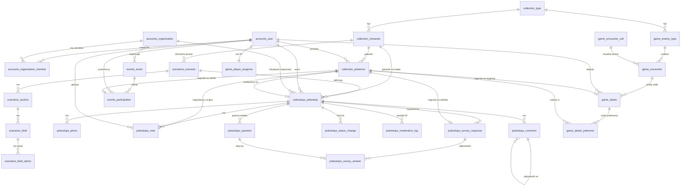

# Baza danych

PostgreSQL 15+ z **PostGIS** (współrzędne) i **citext** (e-maile bez rozróżniania wielkości liter).
Wymagania źródłowe: [`../opis.md`](../opis.md). Kontrakt API: [`../api-contract.md`](../api-contract.md).

## Pliki

| Plik | Zawartość |
|---|---|
| [`schema.sql`](schema.sql) | Struktura: 29 tabel, 1 widok, 16 typów ENUM, 13 triggerów (niezmienniki), indeksy |
| [`seed_reference.sql`](seed_reference.sql) | Słowniki: typy, postacie, szablony przeciwników (**generowany** z `backend/config/seed/reference.yaml`: `python manage.py export_reference`) |
| [`seed_scenarios.sql`](seed_scenarios.sql) | Katalog 26 scenariuszy (**generowany** z kodu frontendu) |

Kolejność: `schema.sql` → `seed_reference.sql` → `seed_scenarios.sql`.

```bash
createdb smartcity
psql smartcity -v ON_ERROR_STOP=1 -f docs/db/schema.sql -f docs/db/seed_reference.sql -f docs/db/seed_scenarios.sql
```

Odtworzenie seedu scenariuszy po zmianie katalogu we frontendzie: `cd frontend && npm run db:seed-scenarios`.

> **Django:** to docelowy kształt, a nie zamiennik migracji. Modele mają go odwzorować, a `makemigrations` wygeneruje DDL
> (`django.contrib.gis` dla pól geograficznych, `CITextField`, ograniczenia jako `CheckConstraint`/`UniqueConstraint`).
> Tabele są nazwane tak jak w Django (`<aplikacja>_<model>`), więc mapowanie jest 1:1. Triggery trzeba dodać przez `RunSQL`.

> **Stan weryfikacji:** schemat i seedy przechodzą parser PostgreSQL (`pglast`), a kolejność kluczy obcych i brak cykli
> między aplikacjami sprawdzono automatycznie. **Nie był uruchomiony na żywej bazie**, więc pierwsze `psql -f` to pierwszy
> test wykonania.

## Implementacja w Django

Backend ([`../../backend/`](../../backend/README.md)) wykonuje schemat przez **migracje Django**, a `schema.sql` zostaje wzorcem.
Test (`backend/tests/test_contract_and_schema.py`) porównuje tabele i kolumny i oblewa się przy każdym rozjeździe poza trzema świadomymi:

1. `location geography` w DDL, a w Django `lat` + `lng` (bez GeoDjango i GDAL; odległość liczy aplikacja),
2. zastępczy klucz `id` w tabelach, które w DDL mają klucz złożony (Django wymaga jednego klucza głównego),
3. kolumna `pokestop_id` w odpowiedziach ankiety (w DDL potrzebna do złożonych kluczy obcych, w Django spójność pilnuje serwis).

Triggery z `schema.sql` (liczniki głosów, własność pokemona, limit trzech w walce) są w Django realizowane w warstwie serwisów w jednej transakcji
(wzorzec: `apps/pokestops/services.py`), więc migracje nie wymagają `RunSQL`. Stałe gry leżą w `backend/config/default.yaml`.

## Podział na aplikacje (SRP)

| Aplikacja | Odpowiada za | Tabele |
|---|---|---|
| `accounts` | tożsamość, role, organizacje | `accounts_user`, `accounts_organization`, `accounts_organization_member` |
| `collection` | typy, postacie i posiadane pokemony | `collection_type`, `collection_character`, `collection_pokemon`, widok `collection_user_character` |
| `scenarios` | katalog formularzy (dane, nie kod) | `scenarios_scenario`, `_section`, `_field`, `_field_option` |
| `pokestops` | pinezki, głosy, komentarze, zdjęcia, ankiety, moderacja | `pokestops_pokestop`, `_photo`, `_vote`, `_comment`, `_status_change`, `_moderation_log`, `_question`, `_survey_response`, `_survey_answer` |
| `events` | wydarzenia organizacji i udział w nich | `events_event`, `events_participation` |
| `game` | przeciwnicy, walki (moc/typ/mnożnik), XP gracza | `game_enemy_type`, `game_encounter_cell`, `game_encounter`, `game_attack`, `game_attack_pokemon`, `game_player_progress` |

Zależności (sprawdzone z kluczy obcych, **bez cykli**):

```
accounts   ←  collection  ←  scenarios  ←  pokestops
                  ↑                            
                  ├──── events  (→ accounts, collection)
                  └──── game    (→ accounts, collection)
pokestops → accounts, collection, scenarios
```

Kluczowa zasada: **`collection` nie zna nikogo oprócz `accounts`.** Źródła nowych pokemonów (walka, ankieta, wydarzenie)
wskazują na pokemona (`game_attack.reward_pokemon_id`, `pokestops_survey_response.reward_pokemon_id`,
`events_participation.reward_pokemon_id`), a nie odwrotnie. Dzięki temu nie ma cyklicznych kluczy obcych ani
dwustronnych zależności między aplikacjami Django, a schemat nie potrzebuje żadnego `ALTER TABLE` po fakcie.

## Skąd bierze się nowy pokemon

`collection_pokemon.origin` ma cztery wartości, a każda ma jedno źródło i gwarancję "raz":

| `origin` | Źródło | Gwarancja jednorazowości |
|---|---|---|
| `starter` | `/auth/guest`, `/auth/register` | częściowy unikalny indeks: jeden na użytkownika |
| `encounter` | wygrana walka (`game_attack.reward_pokemon_id`) | jedno zwycięstwo na przeciwnika (częściowy unikalny indeks) |
| `survey` | wypełniona ankieta (`pokestops_survey_response`) | `UNIQUE (pokestop_id, user_id)` |
| `event` | zameldowanie na wydarzeniu (`events_participation`) | klucz główny `(event_id, user_id)` |

Głos i potwierdzone zgłoszenie **nie** tworzą nowego pokemona, tylko dają exp istniejącemu (patrz niżej).

## Walka pokemonami

1. **Typy.** Każda postać (`collection_character`) i szablon przeciwnika (`game_enemy_type`) ma `type_id`
   (słownik `collection_type`: transport, czystość, zieleń, energia, powietrze, infrastruktura).
2. **Moc.** Poziom i moc pokemona **nie są kolumnami**: baza trzyma tylko `collection_pokemon.exp`, a aplikacja wylicza
   poziom (100 exp na poziom) i moc (`base_power + power_growth × (poziom − 1)`). `game_encounter.power` jest migawką mocy
   z chwili wygenerowania.
3. **Wybór pokemonów.** Do 3 własnych, niezastawionych pokemonów (`game_attack_pokemon`, limit wymuszony triggerem).
4. **Mnożnik typu.** Ten sam typ co przeciwnik: moc ×1.2. Baza zapisuje zastosowany mnożnik (`type_multiplier_applied`).
5. **Rozstrzygnięcie.** Suma mocy większa od mocy przeciwnika → `won`, inaczej `lost`. Za daleko → `too_far` (do walki nie
   dochodzi). Podejrzana pozycja → `rejected`.
6. **Nagrody za wygraną** (w jednej transakcji w aplikacji): exp dla każdego użytego pokemona (`game_attack_pokemon.exp_gained`),
   nowy pokemon `origin='encounter'` (`game_attack.reward_pokemon_id`), XP gracza (`game_player_progress.xp`).

## Pokemony poza walką

- **Zastaw na zgłoszeniu** (`report`/`idea`): autor zostawia jednego z własnych pokemonów
  (`pokestops_pokestop.staked_pokemon_id`). Trigger oznacza go `is_staked` i pilnuje, że należy do autora, jest dostępny
  i ma gatunek zgodny z `character_id` pinezki. **Zwrot** zapisuje aplikacja (`stake_released_at`, `stake_bonus_exp`):
  przy progu głosów i przy `resolved` z premią exp, przy `rejected` i wycofaniu bez premii. Trigger tylko zdejmuje
  `is_staked`, gdy zwrot zostaje zapisany.
- **Głos** (każdy typ pinezki): głosujący wskazuje własnego pokemona (`pokestops_vote.rewarded_pokemon_id`), który dostaje exp.
  Baza zapisuje, ile exp przyznano (`exp_granted`), oraz **pozycję i odległość** głosującego (`location`, `distance_m`),
  bo głosować można tylko z bliska (`opis.md`).

## Ankiety

Pinezka `ngo`/`consultation` może mieć pytania (`pokestops_question`: typ, wymagane, opcje, zakres). Wypełnienie to jedna
`pokestops_survey_response` (pozycja, odległość, pokemon-nagroda) z odpowiedziami w `pokestops_survey_answer`. Odpowiedzi są
znormalizowane (jeden wiersz na pytanie), a klucze złożone gwarantują, że odpowiedź dotyczy pytania z tej samej pinezki.
Dzięki temu organizacja dostaje zbiorcze wyniki zwykłym `GROUP BY`, a nie przetwarzaniem JSON-a.
Reguła "ankiety tylko przy `ngo`/`consultation`" jest po stronie aplikacji (klucz złożony nie wyrazi jej w SQL).

## Wydarzenia

`events_event` (organizacja, miejsce, okno czasu, opcjonalny limit miejsc i wiek, nagroda) i `events_participation`
(zameldowanie z pozycją, jeden udział i jedna nagroda na użytkownika). Nagrodą jest postać z `is_event_exclusive = true`,
czyli taka, która nie wypada z walk ani ankiet. Obecność w czasie trwania i w zasięgu sprawdza aplikacja, a baza zapisuje pozycję.

## Moderacja AI

Agent (zahardkodowany prompt, odpowiedź tylko tak/nie) ocenia zgłoszenia mieszkańców przed zapisem. `pokestops_moderation_log`
trzyma treść, werdykt (`approved`/`rejected`/`error`), model i czas. Odrzucone zgłoszenie i błąd agenta **nie tworzą pinezki**
(CHECK `moderation_only_approved_saved`), a log pozwala je analizować i poprawiać prompt. `pokestops_status_change` służy
późniejszym zmianom przez administratora.

## Diagram



## Decyzje projektowe

- **Reguły spójności w bazie, nie tylko w kodzie:** jeden głos i jedna ankieta na użytkownika (klucze), jedno zwycięstwo na
  przeciwnika (częściowy unikalny indeks), max 3 pokemony na walkę (trigger), typ pinezki zgodny z typem scenariusza
  (klucz złożony), organizacja wymagana dla `ngo`/`consultation`, odpowiedź ankiety wskazuje pytanie z tej samej pinezki
  (klucz złożony), stawiany i nagradzany pokemon należy do właściciela (triggery), jeden pokemon startowy na użytkownika.
- **Stałe gry nie są w bazie ani w triggerach:** exp za głos, premia za zwrot, mnożnik typu, zasięg interakcji (50 m)
  to stałe w kodzie aplikacji. Baza zapisuje **wynik** (`exp_granted`, `stake_bonus_exp`, `type_multiplier_applied`,
  `distance_m`), więc zmiana stałej nie psuje historii ani nie wymaga migracji. Triggery pilnują tylko niezmienników
  (liczniki, własność, limit trzech), a nie reguł, które się stroi.
- **`details jsonb`** na pola scenariusza: katalog się zmienia bez migracji, walidacja względem definicji jest po stronie
  aplikacji. Pinezka zapamiętuje `scenario_version`.
- **Liczniki głosów** (`votes_for`, `votes_against`) utrzymuje trigger, żeby lista na mapie nie liczyła głosów przy każdym zapytaniu.
- **Poziom/moc pokemona i gracza nie są kolumnami**: wzór może się zmieniać, więc baza trzyma `exp`/`xp`. Migawki
  (`game_encounter.power`, `game_attack_pokemon.power_used`) zapisują wynik wzoru z chwili zdarzenia.
- **Zdjęcia:** w bazie tylko metadane i klucz w magazynie obiektów (max 3 na pinezkę, 5 MB, tylko obrazy).
- **Dziennik prób walki** (`game_attack`) zapisuje pozycję klienta, odległość policzoną przez serwer, dokładność GPS i wynik
  (moc łączna, użyte pokemony): podstawa antyoszustwa, limitów częstotliwości i historii walk.
- **Komentarze z wątkami:** `parent_comment_id` (jeden poziom, egzekwowany w aplikacji).
- **Usuwanie użytkowników:** klucze obce na autorach są `RESTRICT`. Przy żądaniu usunięcia konta anonimizujemy dane
  (nazwa, e-mail), a nie kasujemy historii inicjatyw ani pokemonów.

## Czego ta wersja nie zawiera

- Tabel technicznych Django (`django_session`, uprawnienia, migracje) i modelu użytkownika Django (`is_staff` itp.).
- Wielu miast (tenantów): decyzja nr 1 w [`api-contract.md`](../api-contract.md).
- Pełnej tablicy przewag typów (jest tylko bonus 1.2x za zgodność typu, zgodnie z `opis.md`).
- Tabeli konfiguracji gry (`game_config`): decyzja nr 4 w `api-contract.md`.
- Powiadomień i rankingów.
