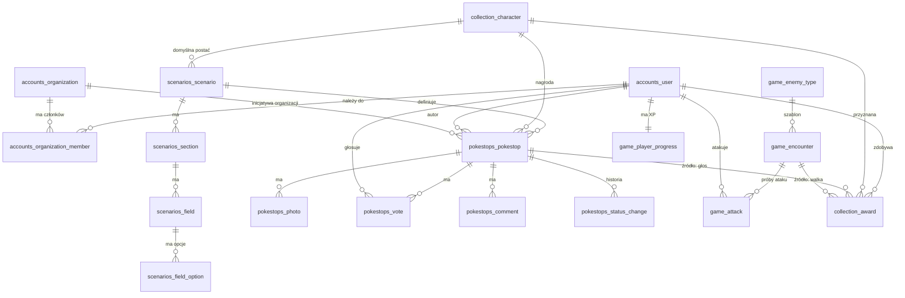

# Baza danych

PostgreSQL 15+ z **PostGIS** (współrzędne) i **citext** (e-maile bez rozróżniania wielkości liter).

## Pliki

| Plik | Zawartość |
|---|---|
| [`schema.sql`](schema.sql) | Struktura: 18 tabel, 1 widok, 14 typów ENUM, indeksy, triggery |
| [`seed_reference.sql`](seed_reference.sql) | Słowniki: 5 postaci i 4 szablony przeciwników |
| [`seed_scenarios.sql`](seed_scenarios.sql) | Katalog 20 scenariuszy (**generowany** z kodu frontendu) |

Kolejność: `schema.sql` → `seed_reference.sql` → `seed_scenarios.sql`.

```bash
createdb smartcity
psql smartcity -v ON_ERROR_STOP=1 -f docs/db/schema.sql -f docs/db/seed_reference.sql -f docs/db/seed_scenarios.sql
```

Odtworzenie seedu scenariuszy po zmianie katalogu we frontendzie: `cd frontend && npm run db:seed-scenarios`.

> **Django:** to docelowy kształt, a nie zamiennik migracji. Modele mają go odwzorować, a `makemigrations` wygeneruje DDL
> (`django.contrib.gis` dla pól geograficznych, `CITextField`, ograniczenia jako `CheckConstraint`/`UniqueConstraint`).
> Tabele są nazwane tak jak w Django (`<aplikacja>_<model>`), więc mapowanie jest 1:1.

## Diagram



## Podział na aplikacje (SRP)

| Aplikacja | Odpowiada za | Tabele |
|---|---|---|
| `accounts` | tożsamość, role, organizacje | `accounts_user`, `accounts_organization`, `accounts_organization_member` |
| `scenarios` | katalog formularzy (dane, nie kod) | `scenarios_scenario`, `_section`, `_field`, `_field_option` |
| `pokestops` | pinezki, głosy, komentarze, zdjęcia, moderacja | `pokestops_pokestop`, `_photo`, `_vote`, `_comment`, `_status_change` |
| `collection` | postacie i ich zdobywanie | `collection_character`, `collection_award`, widok `collection_user_character` |
| `game` | przeciwnicy, walki, XP | `game_enemy_type`, `game_encounter`, `game_attack`, `game_player_progress` |

Zależności: `pokestops` → `scenarios`, `accounts`, `collection`; `game` → `accounts`; `collection_award` wskazuje na `pokestops` i `game`.

## Decyzje projektowe

- **Reguły spójności w bazie, nie tylko w kodzie:** jeden głos na użytkownika (klucz główny), jedno zwycięstwo na przeciwnika (częściowy unikalny indeks), typ pinezki zgodny z typem scenariusza (klucz złożony), organizacja wymagana dla `ngo` i `consultation`, nagroda za głos tylko raz.
- **`details jsonb`** na pola scenariusza: katalog się zmienia bez migracji. Walidacja względem definicji pól jest po stronie aplikacji (baza pilnuje tylko, że to obiekt). Pinezka zapamiętuje `scenario_version`, więc starsze zgłoszenia da się poprawnie wyświetlić po zmianie scenariusza.
- **Liczniki głosów** (`votes_for`, `votes_against`) utrzymuje trigger, żeby lista na mapie nie liczyła głosów przy każdym zapytaniu.
- **Kolekcja z dziennika nagród** (`collection_award`), a nie z licznika: widać skąd pochodzi każda postać i nie ma rozjazdów. Widok `collection_user_character` daje liczby.
- **Poziom gracza nie jest kolumną:** wzór (dziś 100 XP na poziom) może się zmienić, więc baza trzyma tylko `xp`.
- **Zdjęcia:** w bazie tylko metadane i klucz w magazynie obiektów (max 3 na pinezkę, 5 MB, tylko obrazy).
- **Dziennik prób ataku** (`game_attack`) zapisuje pozycję klienta, odległość policzoną przez serwer i dokładność GPS: podstawa antyoszustwa i limitów częstotliwości.
- **Usuwanie użytkowników:** klucze obce na autorach są `RESTRICT`. Przy żądaniu usunięcia konta anonimizujemy dane (nazwa, e-mail), a nie kasujemy historii inicjatyw.

## Czego ta wersja nie zawiera

- Tabel techniczne Django (`django_session`, uprawnienia, migracje) i modelu użytkownika Django (`is_staff` itp.): dołożą je migracje.
- Wielu miast (tenantów): patrz pytanie otwarte nr 1 w [`api-contract.md`](../api-contract.md).
- Powiadomień, rankingów i walk między kolekcjonerskimi postaciami (kolejny etap gry).
